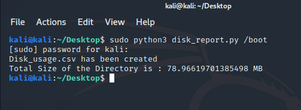
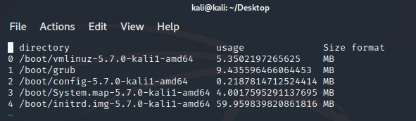

# Linux Disk Memory Monitor

Python script that monitors the **Disk Memory Usage** and gives a detailed CSV report. You can also specify the directory you want the report to be generated for.

## Usage

By default the path is set to "/home" . But can be changed to any location using command line arguments.
```
sudo python3 disk_report.py

            (or)

sudo python3 disk_report.py /opt
```

## Libraries Used

1. sys
2. os
3. pandas

## Working



